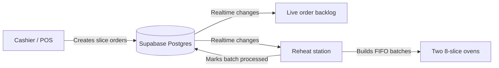
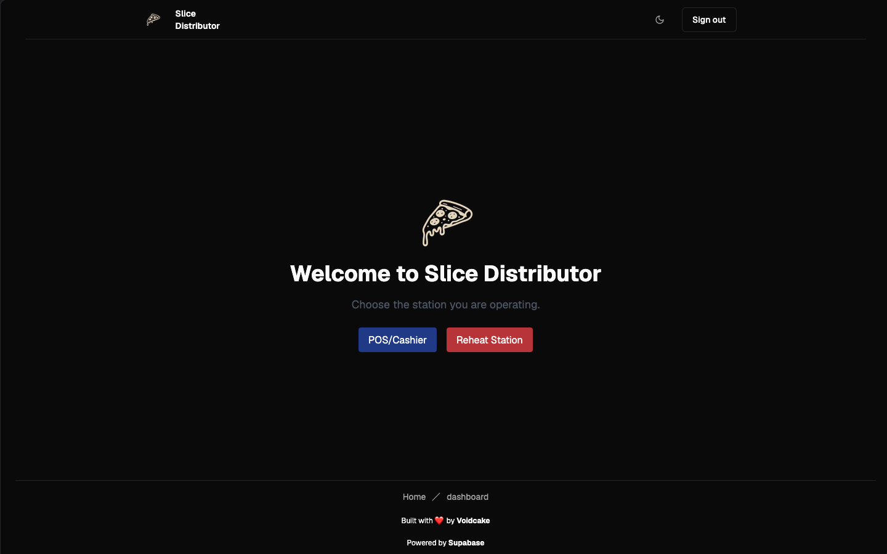
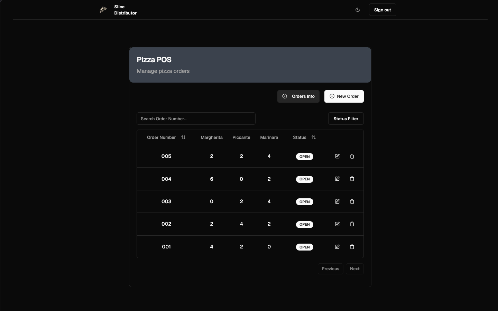
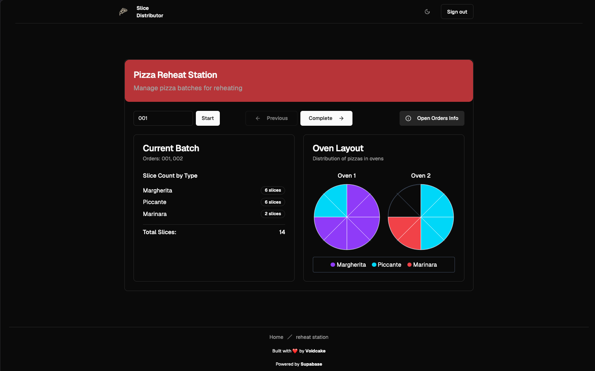

# Slice Distributor

[](https://github.com/Voidcake/slice-distributor/actions/workflows/ci.yml)

Slice Distributor is an operations tool for a fast-paced pizza pop-up. The current MVP connects a cashier-facing order queue to a reheat-station workflow, groups orders into oven batches, and keeps both views synchronized through Supabase Realtime.

> **Project status:** scope-locked MVP focused on authenticated slice-order entry and reheat batching. Inventory, bake planning, product availability, full-pie orders, and operational analytics appear in an earlier product exploration, but are explicitly out of scope and are not planned features of this repository.

## Why this exists

During service, staff need to turn a stream of slice orders into simple, capacity-aware oven instructions without losing order sequence. This project explores that workflow with a tablet-friendly interface and shared live state.

## Current features

- Email/password authentication with Supabase
- Create, edit, filter, and delete slice orders
- Live order updates through Supabase Realtime
- Capacity-aware batching across two ovens
- Forward/backward reheat batch navigation
- Responsive UI with dark mode
- Multi-stage hardened container build using a non-root distroless runtime

## Architecture

- **Frontend:** Next.js 15 App Router, React 19, TypeScript, Tailwind CSS, shadcn/ui, React Hook Form, and Zod
- **Backend:** Supabase Auth, Postgres, Row Level Security, and Realtime
- **Deployment:** Next.js standalone output with Docker/Compose

The browser talks directly to Supabase using the public client key. Database Row Level Security restricts order access to authenticated users; the Next.js middleware also protects all operational pages.



### What this project demonstrates

- Translating a time-sensitive operational workflow into a focused interface
- Separating deterministic domain logic from React and database concerns
- Handling concurrent order-number allocation transactionally in Postgres
- Synchronizing multiple operator screens with Realtime events
- Applying authentication, Row Level Security, validation, tests, CI, and hardened containers

### Permission model

The MVP uses a deliberately shared operator role: every authenticated event staff member can create, update, process, and delete orders. Destructive bulk deletion requires confirmation. Fine-grained cashier and reheat-station roles are outside this repository's scope and should be added before adapting the project to an untrusted multi-tenant environment.

## Run locally

Prerequisites: Node.js 22, npm, and a Supabase project.

1. Clone the repository and enter the application directory:

   ```bash
   git clone https://github.com/Voidcake/slice-distributor.git
   cd slice-distributor
   ```

2. Install dependencies with `npm ci`.
3. Copy `.env.example` to `.env.local` and add your Supabase project values.
4. Apply the SQL files in [`supabase/migrations`](supabase/migrations) in filename order. Enable Realtime for `public.orders` if needed.
5. Run `npm run dev` and open [http://localhost:3000](http://localhost:3000).

## Product walkthrough

### Operator dashboard



### Live order queue



### Capacity-aware reheat batch



## Demo walkthrough

1. Sign in and open the **POS** station.
2. Create several orders with up to 16 total slices each.
3. Open the **Reheat Station** in a second browser window.
4. Start from the first order number and inspect the generated two-oven layout.
5. Complete a batch and watch both stations update in real time.
6. Use **Previous** or **Reset Reheat Station** to demonstrate recovery controls.

## Quality checks

With Node.js 22:

```bash
npm test
npm run typecheck
npm run build
```

Or run the same clean pipeline without installing Node.js on the host:

```bash
docker compose -f compose.validate.yml run --rm validate
```

The validation service mounts the repository read-only, installs dependencies into a temporary in-container filesystem, disables telemetry, and removes the container when finished. Docker's downloaded base image and build cache remain managed by Docker Desktop.

## Container deployment

The hardened deployment choices are documented in [`doc/container-hardening.md`](doc/container-hardening.md).

```bash
docker compose -f compose.hardened.yml up --build
```

## Scope

This repository intentionally demonstrates one focused workflow: accepting slice orders and distributing them into reheat batches. [`doc/requirements.md`](doc/requirements.md) is retained as historical product exploration. Its broader features are neither implemented nor on this project's roadmap.

Remaining work is limited to reliability, tests, maintainability, accessibility, and presentation quality. See [the engineering audit](doc/engineering-audit.md).

## Author

Built by [Voidcake](https://github.com/Voidcake).
